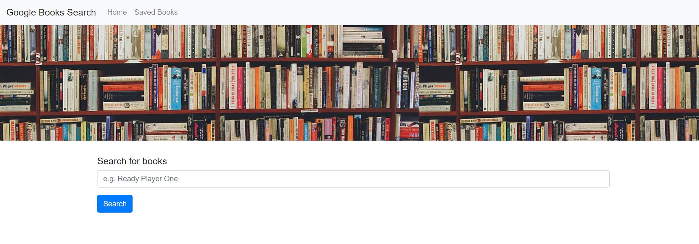
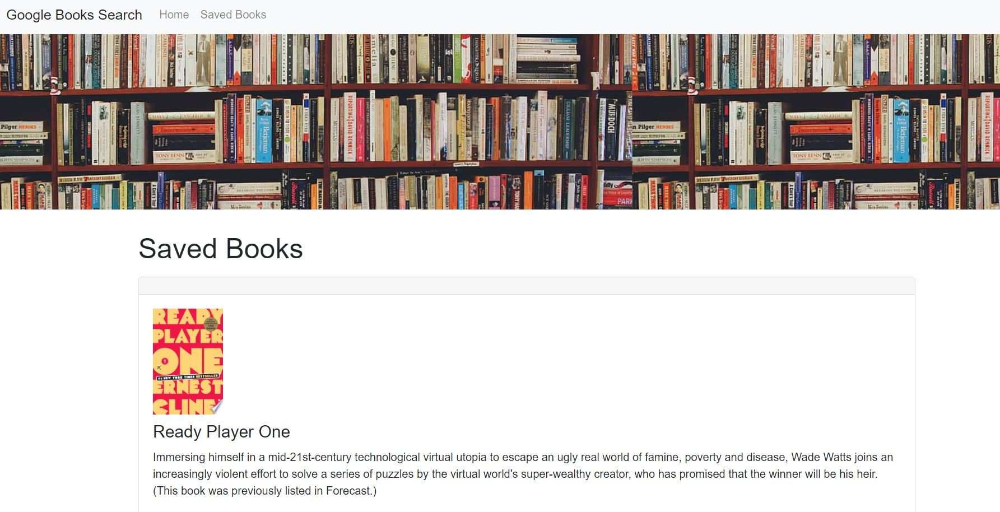

# Google Books Search

## Table of Contents
- [Description](#descriptiongo)
- [Installation Instructions](#installgo)
- [Usage](#usagego)
- [Authors](#authorgo)
- [Deployed Links](#deployedgo)
- [Questions](#contactgo)
        
## Description

A full stack MERN react application

## Installation Instructions

React.JS 
## Usage

This App is used to search and save books from the entire Google Books library.
## License

MIT License

## Authors

Shawn A. Rather

## Deployed

https://morning-inlet-35060.herokuapp.com/
## Questions

Refer to github or send email with any questions:

SAR-SA

sarsa.web@gmail.com
